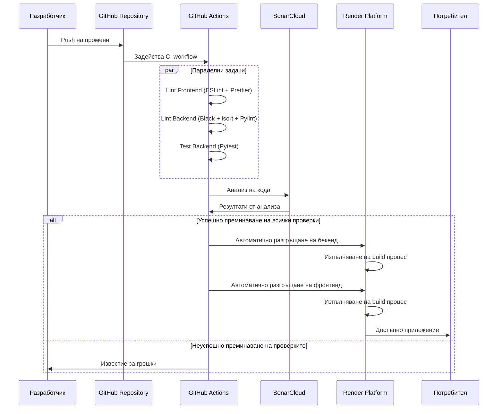

# CI/CD Процес на Expense Tracker

Този документ описва процеса на Continuous Integration и Continuous Deployment (CI/CD) на Expense Tracker приложението, използвайки GitHub Actions и Render.

## Общ преглед на процеса



## GitHub Actions Workflow

Проектът използва един основен workflow файл (`.github/workflows/ci.yml`), който обхваща всички аспекти на CI/CD процеса.

### Тригери на workflow

Workflow се задейства при:
- Push към `main` клона
- Pull Requests към `main` клона

### Етапи на workflow

1. **Lint Frontend**
   - Изпълнява ESLint проверки
   - Проверява форматирането с Prettier
   - Гарантира, че фронтенд кодът отговаря на установените стандарти

2. **Lint Backend**
   - Изпълнява Black за форматиране на Python код
   - Проверява подредбата на импортите с isort
   - Изпълнява Pylint за статичен анализ

3. **Test Backend**
   - Изпълнява тестове с pytest
   - Генерира отчети за покритие на кода
   - Използва SQLite база данни за тестовете

4. **SonarCloud Analysis**
   - Анализира цялостното качество на кода
   - Проверява за уязвимости в сигурността
   - Идентифицира code smells и други проблеми
   - Използва отчетите за покритие от тестовете

5. **Deploy to Render** (само при push към main)
   - Автоматично разгръща бекенд услугата
   - Изчаква завършването на разгръщането на бекенда
   - Автоматично разгръща фронтенд услугата

## Конфигурация на GitHub Secrets

За правилното функциониране на CI/CD процеса, следните GitHub Secrets трябва да бъдат конфигурирани:

| Secret | Описание |
|--------|----------|
| `SONAR_TOKEN` | Токен за достъп до SonarCloud |
| `RENDER_API_KEY` | API ключ за Render.com платформата |
| `RENDER_BACKEND_SERVICE_ID` | ID на бекенд услугата в Render |
| `RENDER_FRONTEND_SERVICE_ID` | ID на фронтенд услугата в Render |

## Разгръщане на Render

Разгръщането на Render се управлява чрез `render.yaml` файл, който дефинира:
- Конфигурация на бекенд услугата
- Конфигурация на фронтенд услугата
- Настройки на средата за изпълнение
- Зависимости между услугите

### Процес на разгръщане

1. **Build Stage**
   - Инсталиране на зависимостите
   - Компилиране/изграждане на приложението
   - Изпълнява миграции на базата данни (ако е необходимо)

2. **Deploy Stage**
   - Стартиране на услугите
   - Прилагане на променливите на средата
   - Свързване на постоянно хранилище за SQLite базата данни

## Добри практики за разработчици

За да поддържате CI/CD процеса ефективен:

1. **Редовно изпълнявайте локални тестове**
   ```bash
   # За бекенд
   cd backend
   python -m pytest
   
   # За фронтенд
   cd frontend
   npm run lint
   ```

2. **Следвайте стандартите за код**
   - Използвайте предоставените linting инструменти
   - Форматирайте кода преди да го commit-нете

3. **Създавайте атомарни commit-и**
   - Всеки commit трябва да представлява една логическа промяна
   - Използвайте ясни commit съобщения

4. **Използвайте feature branches и pull requests**
   - Разработвайте нови функционалности в отделни клонове
   - Използвайте pull requests за код ревю преди сливане

## Мониторинг и поддръжка

- Следете резултатите от GitHub Actions workflow-а
- Проверявайте SonarCloud dashboard за проблеми с качеството
- Наблюдавайте логовете на Render за проблеми с разгръщането или изпълнението 