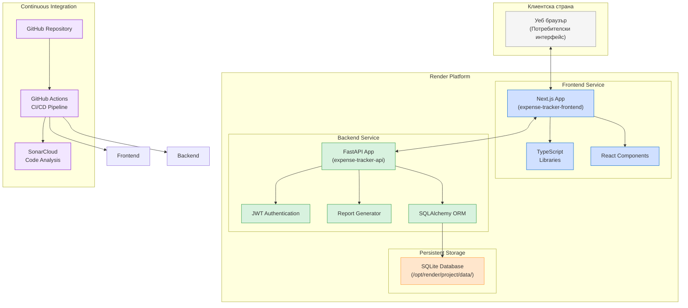

# Диаграма на разполагане (Deployment Diagram)

Този документ предоставя диаграма на разполагане за Expense Tracker приложението, показвайки как различните компоненти са разположени и взаимодействат в production среда.

## Диаграма на разполагане

## Ключови компоненти

### Клиентска страна
- **Уеб браузър**: Потребителският интерфейс, чрез който крайните потребители достъпват приложението.

### Frontend Service (Render Web Service)
- **Next.js Application**: SSR React приложение за потребителския интерфейс
- **TypeScript Libraries**: Типизирани библиотеки за подобрена поддръжка на кода
- **React Components**: Преизползваеми UI компоненти

### Backend Service (Render Web Service)
- **FastAPI Application**: Python REST API за бизнес логиката
- **JWT Authentication**: Сигурна автентикация с JSON Web Tokens
- **SQLAlchemy ORM**: Обектно-релационно мапиране за базата данни
- **Report Generator**: Модул за генериране на PDF и CSV отчети

### Persistent Storage
- **SQLite Database**: Вградена релационна база данни
- **Render Persistent Disk**: Запазване на данните между рестартирания на услугата

### Continuous Integration
- **GitHub Repository**: Хранилище на изходния код
- **GitHub Actions**: Автоматизирана CI/CD pipeline
- **SonarCloud**: Статичен анализ на кода и проверка на качеството

## Процес на разполагане (Deployment)

1. **Разработка**:
   - Разработчиците пишат код на локалната машина
   - Тестът приложението с локална SQLite база данни

2. **Интеграция**:
   - Промените се добавят в GitHub хранилището
   - GitHub Actions автоматично стартира процеса на CI/CD
   - Изпълняват се тестове и статичен анализ на кода чрез SonarCloud

3. **Разполагане**:
   - При успешно преминаване на тестовете, промените се разполагат на Render платформата
   - Render извършва автоматично изграждане (build) на приложението с файла render.yaml
   - Обновените услуги стават достъпни за крайни потребители

## Комуникация между компонентите

- **Браузър ↔ Frontend**: HTTP/HTTPS заявки към Next.js сървъра
- **Frontend ↔ Backend**: REST API заявки чрез Axios HTTP клиент
- **Backend ↔ SQLite**: Запитвания към базата данни чрез SQLAlchemy

## Мащабируемост и поддръжка

Текущата архитектура използва SQLite, което е подходящо за по-малки приложения. За по-голяма мащабируемост:

1. **Преминаване към PostgreSQL**: Лесно преминаване към външна PostgreSQL база данни чрез промяна на настройките.
2. **Хоризонтално мащабиране**: Render поддържа автоматично мащабиране (auto-scaling) за по-натоварени приложения.
3. **CDN интеграция**: За подобрена производителност на статичните активи.

## Наблюдение и алармиране

- **Render Logging**: Централизирано логване за всички услуги
- **Render Metrics**: Наблюдение на използването на ресурси и производителността
- **Health Checks**: Периодични проверки за достъпност на приложението 